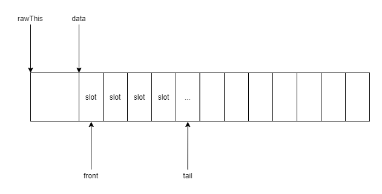
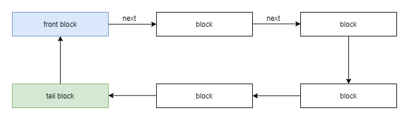

## readerwriterqueue 设计文档

### 基本设计思想

使用循环队列，循环队列的底层基于循环数组实现。

为什么队列的底层不考虑用普通的链表结构：

1. C++ 程序通常是对内存极度敏感的，如果队列的底层使用链表，动态的创建或者删除节点会导致内存的申请和释放，长时间运行会导致内存空洞的问题。
2. 需要考虑队列长度一定要有上限设置，否则队列过大会出现内存问题

即两点要求：

1. 上限设置
2. 固定内存分配

### 循环数组设计

底层是一个数组——block。block 的大小通过模板参数指定，且必须为 2 的倍数。基本结构如下：



block 维护着两个参数：front 和 tail。分别代表 block 中入队和出队的位置。

block 同时维护着 next 指针，指向下一个 block，这是将多个 block 链接成循环队列的关键。

通过数组下标操作实现循环：当 tail 到达数组的最后一个位置的下一个位置，将 tail 置为0，从数组的起始位置继续操作。front 同理。

### 无锁队列设计

无锁队列的基本结构如下:



无锁队列是由多个 block 组成的环状链表。维护着两个指针 frontBlock_ 和 tailBlock_，分别指向下一个要出队元素的 block 和下一个要入队元素的 block

### 入队操作

元素入队的操作步骤如下：

查找 tailBlock_:

```cpp
Block *tailBlock_ = tailBlock.load();
```

读取 tailBlock_ 的 front 和 tail:

```cpp
size_t blockFront = tailBlock_->front.load();
size_t blockTail = tailBlock_->tail.load();
```

判断该 block 是否已满，即判断 tail + 1 是否等于 front

```cpp
// pseudocode
size_t nextBlockTail = blockTail + 1;
if (nextBlockTail == BLOCK_SIZE)
{
    nextBlockTail = 0;
}

if (nextBlockTail == blockFront)
{
    // block 已满
    return false;
}
else
{
    // 元素入队
}
```

如果 tail block 已满，可以读取 tail block 的下一个 nextBlock。并判断 nextBlock 是否已满，并插入操作。

如果 nextBlock 为 nullptr，可以根据模板参数决定是否需要申请新的 block。


### 出队操作

元素出队操作的步骤如下：

读取无锁队列的 frontBlock_:

```cpp
Block *frontBlock_ = frontBlock.load();
```

读取 frontBlock_ 的 front 和 tail:

```cpp
size_t blockTail = frontBlock_->tail.load();
size_t blockFront = frontBlock_->front.load();
```

判断 frontBlock_ 是否为空，即判断 blockFront 是否等于 blockTail

```cpp
// pseudocode
if (blockTail == blockFront)
{
    // empty
    return false;
}
else
{
    // 元素出队
}
```

<font size=3><font color=red>***Talk is cheap, show me the code!***</font></font>